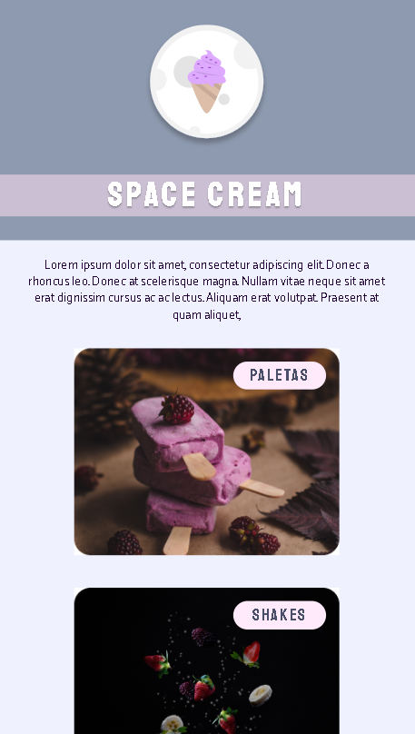

 
 

# 🚀 Rocketseat - Explorer Stage #03 - Space Cream - Mobile First

 

Projeto desenvolvido como parte dos desafios propostos no Stage #03 - Space Cream Mobile First

  <a href="#-tecnologias">Tecnologias</a>&nbsp;&nbsp;&nbsp;|&nbsp;&nbsp;&nbsp;
  <a href="#-projeto">Projeto</a>&nbsp;&nbsp;&nbsp;|&nbsp;&nbsp;&nbsp;
  <a href="#-layout">Layout</a>&nbsp;&nbsp;&nbsp;|&nbsp;&nbsp;&nbsp;

 

# 🛠 Tecnologias
 

Esse projeto foi desenvolvido com as seguintes tecnologias:

- HTML e CSS
- Git
- GitHub

 

# 💻 Projeto

A ideia agora é criar o Space Cream inicialmente para a versão Mobile mas com alguns parâmetros pré-definidos para a versão Desktop.

* Unidades de medida flexíveis;
* Variáveis;
* Animação simples.

 

# 🔖 Layout

Você pode visualizar o layout completo [clicando aqui](https://www.figma.com/file/Z8MWHA00GSsRDJjGjrtl8p/Stage-03---Mobile-First-(Copy)?node-id=0%3A1&t=LctupSSTWmPhFkSP-0). É necessário ter conta no [Figma](https://figma.com) para acessá-lo.

 

---

  Elaborado por Marcelo Neves | ✉ marcsneves@hotmail.com

 
